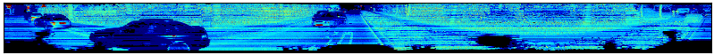
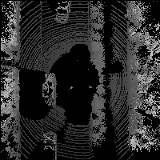

# lidar_projection
3d lidar point cloud 2d image projection in python. 

Requirement:
1. numpy
2. matplotlib
3. [python-pcl](https://github.com/strawlab/python-pcl)
4. (Opt.) ros, for real-time display

File:
1. `tool.py`: methods to load `.pcd` data or kitti `.bin` point cloud data
2. `show.py`: methods to perform projection 

Running:
Not well coded yet, just for test.
```shell
#for ros velodyne points real time projection
python ros_realtiem.py
```
```shell
#for static point cloud data projection
#test.py should be modified
python test.py
```

Resutls:
Front View & Panorama




Bird View	


Thanks [http://ronny.rest/blog](http://ronny.rest/blog)
